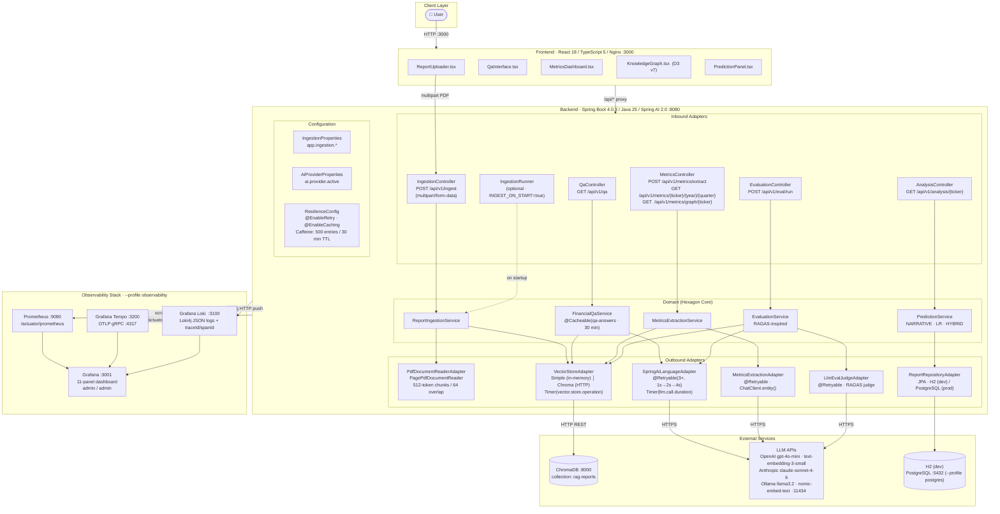
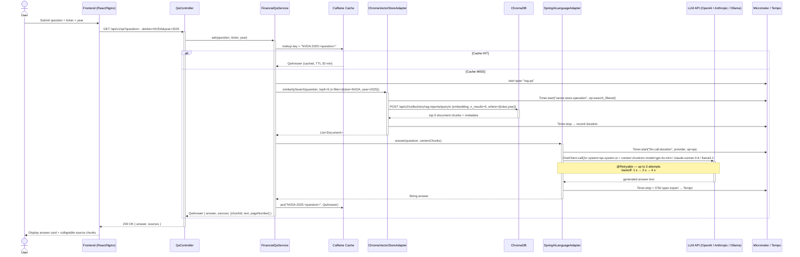

# RAG Financial Report Analyzer — Architecture

## Table of Contents
1. [Architecture Overview](#architecture-overview)
2. [RAG Supply Chain](#rag-supply-chain)
3. [RAG Q&A Sequence Diagram](#rag-qa-sequence-diagram)
4. [STRIDE Threat Model](#stride-threat-model)

---

## Architecture Overview

**Key architectural decisions:**
- **Hexagonal (Ports & Adapters)** — domain core has zero framework dependencies; ArchUnit enforces boundaries
- **Dual ingestion paths** — `POST /api/v1/ingest` (multipart upload via UI) or `IngestionRunner` (auto-ingest on startup with `INGEST_ON_START=true`)
- **Type-safe config** — `@ConfigurationProperties` records (`IngestionProperties`, `AiProviderProperties`) over scattered `@Value`
- **Provider-agnostic LLM** — single `AI_PROVIDER` env var switches OpenAI / Anthropic / Ollama
- **Vector store swap** — `@ConditionalOnProperty` selects `SimpleVectorStore` (dev) or ChromaDB (prod) with zero domain changes
- **Resilience** — `@Retryable` (3×, exponential backoff) on all LLM adapters; Caffeine cache on Q&A answers (500 entries, 30 min TTL)
- **Full observability** — Micrometer (metrics) + OTel OTLP (traces) + Loki4j (logs) → Grafana unified view

---

## RAG Supply Chain

Two data paths flow through the system: the **Ingestion Pipeline** (write path) transforms PDFs into searchable vectors, and the **Retrieval & Generation Pipeline** (read path) answers questions using those vectors.

### Ingestion Pipeline (Write Path)

```mermaid
graph LR
    PDF["📄 PDF Upload<br/><i>SEC 10-K / 10-Q</i><br/><code>POST /api/v1/ingest</code><br/>or IngestionRunner"]
    READ["📖 Document Reading<br/><b>PagePdfDocumentReader</b><br/>1 page = 1 document"]
    CHUNK["✂️ Chunking<br/><b>TokenTextSplitter</b><br/>512 tokens / 64 overlap<br/>split on . ? ! \\n"]
    META["🏷️ Metadata Enrichment<br/><b>ReportIngestionService</b><br/>ticker · year · quarter<br/>report_type · source_file"]
    EMBED["🔢 Embedding<br/><b>EmbeddingModel</b><br/>OpenAI: text-embedding-3-small<br/>Ollama: nomic-embed-text"]
    STORE[("💾 Vector Store<br/><b>SimpleVectorStore</b> (in-memory)<br/>or <b>ChromaDB</b> (persistent)")]

    PDF --> READ --> CHUNK --> META --> EMBED --> STORE

    style PDF fill:#334155,stroke:#94a3b8,color:#f8fafc
    style READ fill:#1e3a5f,stroke:#3b82f6,color:#f8fafc
    style CHUNK fill:#1e3a5f,stroke:#3b82f6,color:#f8fafc
    style META fill:#422006,stroke:#f59e0b,color:#f8fafc
    style EMBED fill:#3b0764,stroke:#a855f7,color:#f8fafc
    style STORE fill:#052e16,stroke:#22c55e,color:#f8fafc
```

| Step | Component | Details |
|------|-----------|---------|
| 1. Upload | `IngestionController` or `IngestionRunner` | Multipart PDF via REST, or auto-ingest on startup (`INGEST_ON_START=true`) |
| 2. Read | `PagePdfDocumentReader` | One `Document` per page, preserves page number metadata |
| 3. Chunk | `TokenTextSplitter` | 512 tokens per chunk, 64-token overlap; splits preferring `.` `?` `!` `\n` boundaries |
| 4. Enrich | `ReportIngestionService` | Attaches `ticker`, `year`, `quarter`, `report_type`, `source_file` to every chunk |
| 5. Embed | `EmbeddingModel` | Converts text → vector (1536-dim OpenAI or 768-dim nomic) |
| 6. Store | `DocumentStorePort` | Vectors + metadata persisted for similarity search |

### Retrieval & Generation Pipeline (Read Path)

```mermaid
graph LR
    Q["❓ User Question<br/>question + ticker + year<br/><code>GET /api/v1/qa</code>"]
    CACHE{"🗄️ Cache Check<br/><b>Caffeine</b><br/>key: ticker:year:question<br/>TTL 30 min · max 500"}
    QEMBED["🔢 Query Embedding<br/><b>EmbeddingModel</b><br/>(same model as ingestion)"]
    SEARCH["🔍 Similarity Search<br/><b>DocumentStorePort</b><br/>topK = 5<br/>filter: {ticker, year}"]
    CTX["📋 Context Assembly<br/><b>Top-K Chunks</b><br/>ranked by cosine similarity"]
    PROMPT["📝 LLM Prompt<br/><b>ChatClient</b><br/>qa-system.st template<br/>system + context + question"]
    LLM["🤖 LLM Generation<br/><b>Language Model</b><br/>GPT-4o-mini / Claude Sonnet<br/>/ Llama 3.2<br/><i>@Retryable 3× · 1s→2s→4s</i>"]
    RESP["✅ Response<br/><b>QaAnswer</b><br/>{ answer, sources:<br/>[{ chunkId, text, pageNumber }] }"]

    Q --> CACHE
    CACHE -->|"HIT"| RESP
    CACHE -->|"MISS"| QEMBED --> SEARCH --> CTX --> PROMPT --> LLM --> RESP

    style Q fill:#334155,stroke:#94a3b8,color:#f8fafc
    style CACHE fill:#042f2e,stroke:#14b8a6,color:#f8fafc
    style QEMBED fill:#3b0764,stroke:#a855f7,color:#f8fafc
    style SEARCH fill:#052e16,stroke:#22c55e,color:#f8fafc
    style CTX fill:#422006,stroke:#f59e0b,color:#f8fafc
    style PROMPT fill:#4c0519,stroke:#f43f5e,color:#f8fafc
    style LLM fill:#4c0519,stroke:#f43f5e,color:#f8fafc
    style RESP fill:#052e16,stroke:#10b981,color:#f8fafc
```

| Step | Component | Details |
|------|-----------|---------|
| 1. Question | `QaController` | Receives question, ticker, year from frontend |
| 2. Cache | `Caffeine` | Key = `ticker:year:question`; on **HIT** returns immediately (30 min TTL, 500 entries) |
| 3. Embed | `EmbeddingModel` | Converts question text → query vector |
| 4. Search | `DocumentStorePort` | Cosine similarity, topK=5, filtered by `{ticker, year}` metadata |
| 5. Assemble | `FinancialQaService` | Collects top-K chunks as context window |
| 6. Prompt | `ChatClient` | Renders `qa-system.st` template with system instructions + context + question |
| 7. Generate | `LanguageModelPort` | LLM call with `@Retryable` (3 attempts, exponential backoff 1s→2s→4s) |
| 8. Response | `QaAnswer` | Answer text + source chunks (chunkId, text, pageNumber) for attribution |

### Color Legend

| Color | Meaning |
|-------|---------|
| 🔵 Blue | Document processing (read, chunk) |
| 🟠 Amber | Domain logic (enrichment, assembly) |
| 🟣 Purple | Embedding (text → vector) |
| 🟢 Green | Storage & retrieval (vector store) |
| 🔴 Rose | LLM interaction (prompt, generation) |
| 🩵 Teal | Caching & resilience |

---

## RAG Q&A Sequence Diagram

---

## STRIDE Threat Model

### System Boundary

The analysis covers: REST API, frontend proxy, backend services, vector store (ChromaDB), LLM adapters, database, and observability stack — all within the Docker Compose network.

---

### S — Spoofing

| # | Threat | Asset | Risk | Mitigation |
|---|--------|-------|------|------------|
| S1 | Any unauthenticated client can call all REST endpoints | All `/api/v1/*` | **High** | Add Spring Security with API-key or JWT bearer authentication |
| S2 | No service-to-service auth in Docker network — ChromaDB and PostgreSQL accept any connection | ChromaDB, PostgreSQL | **Medium** | Enable ChromaDB token auth; use PostgreSQL `pg_hba.conf` host restrictions |
| S3 | Grafana default credentials (`admin/admin`) — anyone can log in | Observability dashboards | **High** | Force password change on first login; use `GF_SECURITY_ADMIN_PASSWORD` env var |
| S4 | Ollama API has no authentication — any process on the Docker network can call it | Local LLM (Ollama) | **Low** (internal only) | Restrict Ollama to Docker-internal network; do not expose port 11434 externally |

---

### T — Tampering

| # | Threat | Asset | Risk | Mitigation |
|---|--------|-------|------|------------|
| T1 | ChromaDB has no auth → embeddings in `rag-reports` collection can be overwritten or poisoned | Vector store data | **High** | Enable ChromaDB `CHROMA_SERVER_AUTHN_CREDENTIALS`; restrict port 8000 to Docker-internal only |
| T2 | No input validation/sanitisation on `question`, `ticker`, `year` parameters → prompt injection via crafted question | LLM prompt | **High** | Validate and sanitise inputs; consider a prompt-injection guard layer |
| T3 | H2 web console enabled (`/h2-console`) in default profile — in-memory DB fully accessible with no auth | Financial metrics (H2) | **Medium** (dev only) | Disable H2 console in non-dev profiles; gate with Spring Security |
| T4 | `@Cacheable` stores answers keyed by `ticker:year:question`; a poisoned answer persists 30 min | Q&A cache | **Medium** | Add cache invalidation endpoint (admin-only); use signed/validated LLM responses |
| T5 | `IngestionRunner` reads from file path (`SAMPLE_PDF_PATH`) — path traversal risk; REST upload uses safe temp files | Host filesystem | **Low** | ✅ REST ingestion writes to temp file (no user-controlled path); validate `SAMPLE_PDF_PATH` at startup |

---

### R — Repudiation

| # | Threat | Asset | Risk | Mitigation |
|---|--------|-------|------|------------|
| R1 | No user identity — no authentication means all requests are anonymous; impossible to attribute actions | Audit log | **High** | Introduce user identity (JWT/session); log user ID in every structured log event |
| R2 | Eval matrix (`POST /api/v1/eval/run/matrix`) and ingestion can be triggered without trace to caller | Audit log, LLM budget | **Medium** | Log caller IP + timestamp + operation; protect write/compute endpoints behind auth |
| R3 | Loki captures logs with `traceId`/`spanId` but no user context — trace is incomplete for non-repudiation | Loki logs | **Low** | Add MDC `userId` field once authentication is in place |

---

### I — Information Disclosure

| # | Threat | Asset | Risk | Mitigation |
|---|--------|-------|------|------------|
| I1 | LLM API keys (`OPENAI_API_KEY`, `ANTHROPIC_API_KEY`) in environment variables — exposed via `docker inspect` or leaked logs | API credentials | **Critical** | Use Docker secrets or a vault (HashiCorp Vault / AWS Secrets Manager); never log env vars |
| I2 | Actuator endpoints `/metrics`, `/prometheus`, `/caches` expose internal state (cache keys, JVM heap, LLM timing) | System internals | **Medium** | Restrict actuator to management port + require auth; set `show-details: never` |
| I3 | Q&A response includes raw `sources` (document chunks with full text and page numbers) — proprietary PDF content exposed to any caller | PDF content (10-K data) | **Medium** | Auth-gate the API; consider redacting or summarising source chunks |
| I4 | H2 console (`/h2-console`) allows full SQL read/write with no credentials | Financial metrics DB | **Medium** | Disabled automatically in postgres profile; ensure never exposed in staging/prod |
| I5 | Stack traces may appear in error responses — expose internal class names and library versions | Implementation details | **Low** | Configure `server.error.include-stacktrace=never` in production |
| I6 | ChromaDB port 8000 and Grafana port 3001 exposed on `0.0.0.0` in docker-compose | Vector data, dashboards | **Medium** | Bind to `127.0.0.1` or use a reverse proxy with TLS; do not expose on public interfaces |

---

### D — Denial of Service

| # | Threat | Asset | Risk | Mitigation |
|---|--------|-------|------|------------|
| D1 | No rate limiting on any endpoint — burst of Q&A requests drains OpenAI/Anthropic API credits | LLM budget | **High** | Add rate limiting (Spring Gateway / nginx `limit_req`); set OpenAI usage limits |
| D2 | `POST /api/v1/eval/run/matrix` runs 3 full RAGAS evaluations (≈60 LLM calls) — a single request is extremely expensive | LLM budget, latency | **High** | Protect behind admin auth; add request queuing; limit to one concurrent run |
| D3 | `@Retryable` (3×) amplifies failures — a misconfigured LLM key sends 3× the failing requests before raising `LlmCallException` | LLM API rate limits | **Medium** | Add circuit breaker (Resilience4j); exponential backoff already in place |
| D4 | Large or malformed PDFs can exhaust heap during chunking | JVM heap | **Medium** | ✅ `spring.servlet.multipart` limits set to 100 MB; add PDF page-count / content validation before chunking |
| D5 | ChromaDB collection has no size cap — unbounded ingestion can fill disk | Disk / ChromaDB | **Low** | Set ChromaDB collection limits; add disk-usage alerts in Grafana |

---

### E — Elevation of Privilege

| # | Threat | Asset | Risk | Mitigation |
|---|--------|-------|------|------------|
| E1 | H2 console (`/h2-console`) is fully open in default profile — any visitor can run arbitrary SQL | Database | **High** | Disable via `spring.h2.console.enabled=false` in non-dev profiles; Spring Security if kept |
| E2 | Actuator `/caches` endpoint allows clearing the Q&A Caffeine cache without authentication | Application state | **Medium** | Require `ACTUATOR_ROLE` to access write actuator endpoints |
| E3 | No RBAC — any user can trigger costly operations: metrics extraction, eval runs, cache inspection | Compute / LLM budget | **Medium** | Introduce roles: `READER` (Q&A), `ANALYST` (extract/predict), `ADMIN` (eval, actuator) |
| E4 | Grafana `admin/admin` → full dashboard/datasource management, can reconfigure Prometheus/Loki/Tempo | Observability infra | **Medium** | Rotate credentials; create read-only viewer accounts for non-admin users |
| E5 | No network segmentation — all Docker services share `rag-network`; a compromised frontend container can reach ChromaDB or PostgreSQL directly | Internal services | **Medium** | Separate Docker networks per tier (frontend ↔ backend, backend ↔ db); use firewall rules |

---

### Risk Summary

| Category | Critical | High | Medium | Low |
|----------|----------|------|--------|-----|
| Spoofing | — | S1, S3 | S2 | S4 |
| Tampering | — | T1, T2 | T3, T4, T5 | — |
| Repudiation | — | R1 | R2 | R3 |
| Information Disclosure | I1 | — | I2, I3, I4, I6 | I5 |
| Denial of Service | — | D1, D2 | D3, D4 | D5 |
| Elevation of Privilege | — | E1 | E2, E3, E4, E5 | — |

> **This system is designed as a learning-oriented POC.** For production deployment, the Critical and High items above must be addressed before exposing the application to untrusted users or the public internet.
