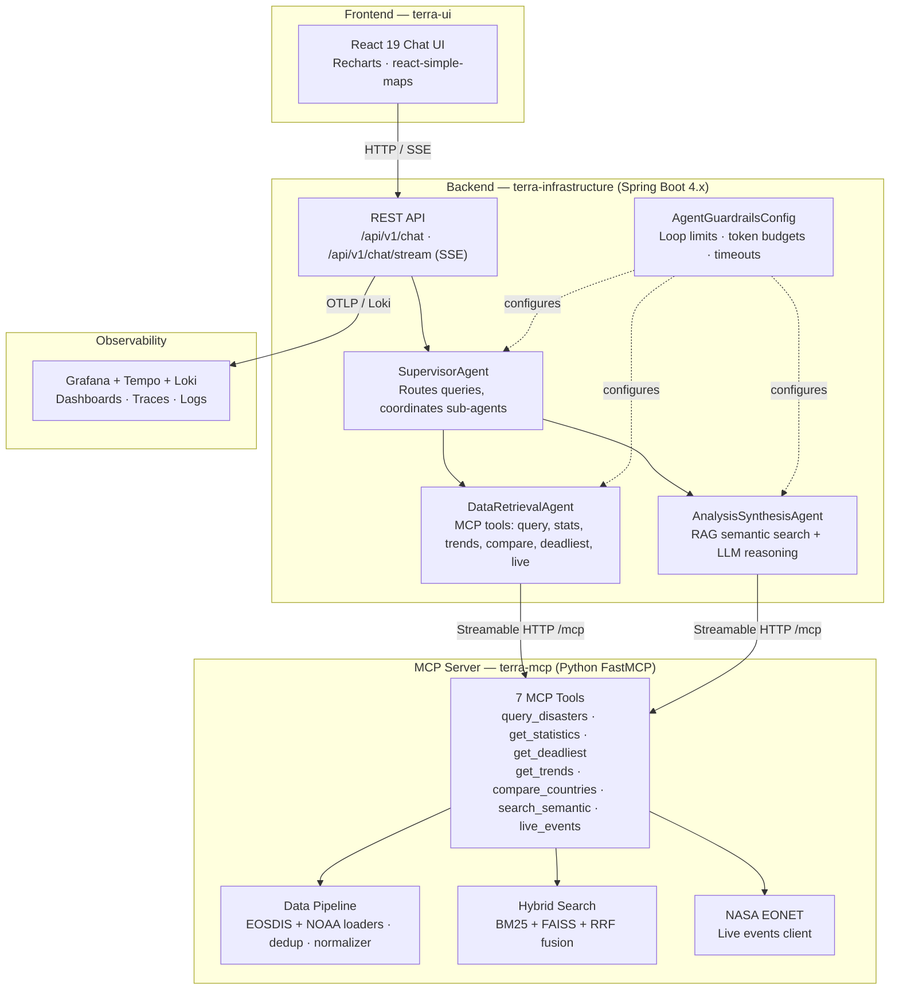
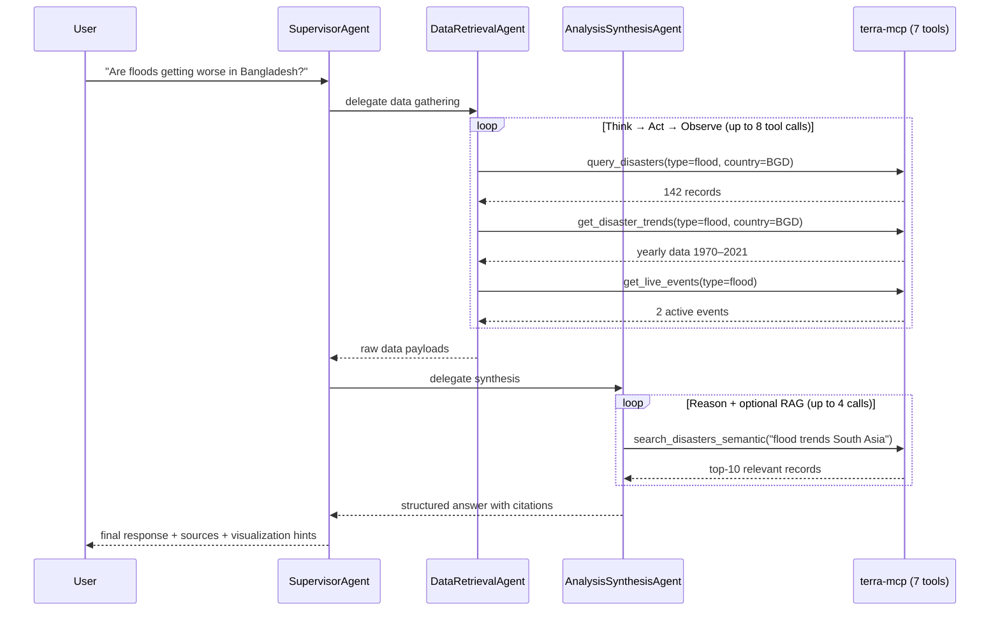

# TerraQuery

A production-ready **multi-agent chatbot** for natural disaster research. TerraQuery answers questions about historical and live natural disasters through specialized LLM agents that autonomously select tools, observe results, and iterate — rather than following hardcoded dispatch logic.

The system combines a **Python MCP tool server** (FastMCP) serving 7 disaster-research tools with a **Java Spring Boot backend** (Spring AI) running a multi-agent coordination loop, fronted by a **React 19 chat UI** with real-time streaming and data visualizations.

---

## Architecture



### Multi-Agent Flow



### Module Structure

```
terra-query/
├── terra-core/                    Domain layer (zero Spring dependencies)
│   └── model/, port/, service/    ChatMessage, Conversation, AgentPort, ChatService
│
├── terra-infrastructure/          Spring Boot app + adapters
│   ├── adapter/in/rest/           ChatController, ConversationController (OpenAPI-generated)
│   ├── adapter/out/agent/         SupervisorAgentAdapter, DataRetrievalAgent, AnalysisSynthesisAgent
│   ├── adapter/out/persistence/   JPA entities + H2 (dev) / PostgreSQL (prod)
│   ├── config/                    AgentConfig, AgentGuardrailsConfig, McpClientConfig
│   ├── streaming/                 SSE ChatEvent, ToolProgressIndicator
│   ├── observability/             TerraQueryMetrics (Micrometer)
│   └── resilience/                Resilience4j circuit breaker + retry
│
├── terra-mcp/                     Python FastMCP server (Docker)
│   ├── server.py                  Entry point — startup, tool registration
│   ├── tools/                     disaster_query, disaster_stats, disaster_rag, live_events
│   ├── data/                      loaders (EOSDIS, NOAA, EONET), quality (dedup, normalizer), index cache
│   ├── search/                    hybrid_search (BM25+FAISS+RRF), hierarchical_chunker
│   ├── validation/                Pydantic tool parameter validation
│   ├── eval/                      RAGAS evaluation runner
│   ├── resilience/                Circuit breaker, retry decorators
│   └── tests/                     unit/, integration/, eval/
│
├── terra-ui/                      React 19 + TypeScript + Vite + Tailwind
│
├── api-spec/
│   └── terra-query-api.yaml       OpenAPI 3.1 contract (code-generated)
│
├── docker/                        Grafana, Tempo, Loki configs
└── docker-compose.yml             Full stack orchestration
```

---

## Prerequisites

| Tool | Version | Notes |
|------|---------|-------|
| **Java** | 25+ | Temurin recommended |
| **Gradle** | Wrapper included | `./gradlew` — no global install needed |
| **Python** | 3.11+ | For terra-mcp server |
| **Node.js** | 22+ | For terra-ui frontend |
| **Docker** + **Docker Compose** | Latest | For full-stack and observability |
| **LLM API key** | At least one | OpenAI (`OPENAI_API_KEY`), Anthropic (`ANTHROPIC_API_KEY`), or local Ollama |

---

## How to Run

### Option 1: Docker Compose (full stack — recommended)

The fastest way to get everything running. Starts the MCP server, Spring Boot backend, React UI, and the Grafana observability stack.

```bash
cd ai-architect/terra-query

# Set your LLM provider API key
export OPENAI_API_KEY=sk-...
# Or for Anthropic:
# export ANTHROPIC_API_KEY=sk-ant-...
# export TERRA_QUERY_AI_PROVIDER=anthropic

# Start all services
docker compose up -d

# Watch logs
docker compose logs -f terra-infrastructure terra-mcp
```

| Service | URL | Description |
|---------|-----|-------------|
| **terra-ui** | http://localhost:5173 | Chat interface |
| **terra-infrastructure** | http://localhost:8080 | REST API + SSE streaming |
| **terra-mcp** | http://localhost:8200 | MCP tool server |
| **Grafana** | http://localhost:3000 | Dashboards, traces, logs |
| **H2 Console** | http://localhost:8080/h2-console | Dev database browser |

To stop everything:

```bash
docker compose down
```

### Option 2: Local development (each service separately)

Best for active development with hot-reload.

#### Step 1 — Start the MCP server (Python)

```bash
cd terra-mcp

# Create a virtual environment (one-time)
python -m venv .venv
source .venv/bin/activate   # or .venv\Scripts\activate on Windows

# Install dependencies
pip install -r requirements.txt

# (Optional) Download disaster data if not present
python scripts/download_data.py

# Use real EOSDIS data (recommended outside local experiments)
# Fails fast on startup if data/eosdis.csv is missing or invalid
export DATA_SOURCE=real

# Start the server
python server.py
# Runs on http://localhost:8080 with streamable-http transport
# Override: MCP_TRANSPORT=sse python server.py
```

The first startup builds FAISS + BM25 indices from scratch (3–5 min for large datasets). Subsequent starts load cached indices in ~2 seconds.

#### Step 2 — Start the Spring Boot backend

```bash
cd ..  # back to terra-query root

# Set your API key
export OPENAI_API_KEY=sk-...

# Build and run
./gradlew :terra-infrastructure:bootRun
```

The backend connects to the MCP server at `http://localhost:8200/mcp` (Docker Compose) or `http://localhost:8080/mcp` (local). When running locally, the MCP server listens on port 8080, so update `application.yml` or set:

```bash
export SPRING_AI_MCP_CLIENT_STREAMABLE_HTTP_CONNECTIONS_TERRA_MCP_URL=http://localhost:8080
export SPRING_AI_MCP_CLIENT_STREAMABLE_HTTP_CONNECTIONS_TERRA_MCP_ENDPOINT=/mcp
```

#### Step 3 — Start the frontend (optional)

```bash
cd terra-ui

npm install
npm run dev
# Runs on http://localhost:5173
```

### Option 3: Local with Ollama (no API keys needed)

Run entirely locally with Ollama for free LLM inference.

```bash
# Install and start Ollama (https://ollama.ai)
ollama pull llama3.2

# Start MCP server (same as Option 2, Step 1)
cd terra-mcp && python server.py &

# Start backend with Ollama provider
cd .. && TERRA_QUERY_AI_PROVIDER=ollama ./gradlew :terra-infrastructure:bootRun
```

Ollama uses `llama3.2` by default. Override with `OLLAMA_MODEL=mistral` or any model you've pulled.

### Option 4: Backend + MCP only (API-only, no UI)

For testing or integration into other tools.

```bash
# Terminal 1: MCP server
cd terra-mcp && python server.py

# Terminal 2: Spring Boot backend
export OPENAI_API_KEY=sk-...
./gradlew :terra-infrastructure:bootRun

# Test with curl
curl -X POST http://localhost:8080/api/v1/chat \
  -H "Content-Type: application/json" \
  -d '{"message": "What was the deadliest earthquake in the 21st century?"}'

# Streaming (SSE)
curl -N -X POST http://localhost:8080/api/v1/chat/stream \
  -H "Content-Type: application/json" \
  -d '{"message": "Are floods getting worse in Bangladesh?"}'
```

---

## Configuration

All agent behavior is configurable via `application.yml` or environment variables — nothing is hardcoded.

### LLM Provider

Switch providers with a single environment variable:

```bash
TERRA_QUERY_AI_PROVIDER=openai      # default — requires OPENAI_API_KEY
TERRA_QUERY_AI_PROVIDER=anthropic   # requires ANTHROPIC_API_KEY
TERRA_QUERY_AI_PROVIDER=ollama      # local, no API key needed
```

### Agent Guardrails

```yaml
terra-query:
  agent:
    guardrails:
      max-supervisor-delegations: 3    # max sub-agent calls per query
      max-retrieval-tool-calls: 8      # max MCP tool calls for DataRetrievalAgent
      max-analysis-tool-calls: 4       # max calls for AnalysisSynthesisAgent
      max-output-tokens: 4096
      context-window-strategy: HYBRID  # SLIDING_WINDOW | SUMMARIZING | HYBRID
      sliding-window-size: 10
      max-queries-per-minute: 20
      daily-cost-cap-usd: 5.00
      agent-timeout-seconds: 60
```

### Hybrid Search (RRF) Tuning

The Reciprocal Rank Fusion parameters are A/B testable via environment variables:

```bash
RRF_K=60                # smoothing constant (default: 60 from Cormack et al.)
RRF_BM25_WEIGHT=1.0     # BM25 contribution weight
RRF_VECTOR_WEIGHT=1.0   # Dense vector contribution weight
EMBEDDING_MODEL=BAAI/bge-base-en-v1.5  # or nomic-embed-text for Ollama
```

### Conversation Persistence

```yaml
terra-query:
  conversation:
    persistence-scope: MESSAGES_ONLY  # lightweight — user + assistant messages only
    # persistence-scope: FULL         # debug — includes tool call arguments + raw results
```

---

## Testing

### Run unit and integration tests

```bash
# Java backend (excludes live LLM tests by default)
./gradlew test

# Build terra-core only (domain, zero Spring)
./gradlew :terra-core:build

# Run with verbose output
./gradlew :terra-infrastructure:test --info

# Python MCP server
cd terra-mcp
pip install -r requirements-dev.txt  # adds pytest, pytest-cov, etc.
pytest tests/
```

### Mutation testing

Validates that tests actually catch bugs, not just cover lines.

```bash
# Java — PIT (target ≥55% kill rate on domain layer)
./gradlew :terra-core:pitest
# Report: terra-core/build/reports/pitest/

# Python — mutmut (target ≥65% on tools/search)
cd terra-mcp
pip install mutmut
mutmut run --no-progress
mutmut results
```

### Live LLM evaluation (requires API keys)

Tests answer quality against a golden dataset of 30 Q&A pairs using RAGAS metrics (context precision, faithfulness, answer relevance).

```bash
# Java — live LLM test suite (canary = 10 questions, full = 30)
export OPENAI_API_KEY=sk-...
export ANTHROPIC_API_KEY=sk-ant-...
./gradlew :terra-infrastructure:liveTest -Psubset=canary

# Python — RAGAS evaluator
cd terra-mcp
python -m eval.eval_runner --subset canary --output-file ragas-results.json
```

### Performance / load testing

```bash
# Gatling load test (requires backend + MCP running)
./gradlew :terra-infrastructure:gatlingRun \
  -DTERRA_QUERY_BASE_URL=http://localhost:8080

# MCP server micro-benchmarks
cd terra-mcp
pytest tests/benchmark/ --benchmark-json=benchmark.json
```

### Memory profiling

```bash
cd terra-mcp
python scripts/memory_profile.py
# Outputs profiling_report.json with per-component breakdown
# Use results to tune Docker memory limits
```

---

## CI/CD Pipelines

| Workflow | Trigger | What it does |
|----------|---------|-------------|
| **terra-query-ci** | Push / PR to `main` | Build + unit/integration tests (Java 25), PIT mutation testing, RAGAS canary eval (10 questions on PRs) |
| **terra-query-mcp-ci** | Push / PR (terra-mcp paths) | Python lint + pytest + coverage for MCP server |
| **terra-query-ragas-eval** | Nightly / manual | Full 30-question RAGAS evaluation with cross-provider judging (OpenAI generates, Anthropic evaluates) |
| **terra-query-live-eval** | Weekly (Sunday) / manual | Live LLM answer quality tests against real APIs |
| **terra-query-pitest** | Nightly | PIT mutation testing for Java domain layer |
| **terra-query-perf** | Weekly (Monday) / manual | Gatling load tests + MCP micro-benchmarks |
| **terra-query-build-deploy** | Manual | Docker build + deploy |

---

## API Reference

The full API is defined in [`api-spec/terra-query-api.yaml`](api-spec/terra-query-api.yaml) (OpenAPI 3.1). Key endpoints:

| Method | Path | Description |
|--------|------|-------------|
| `POST` | `/api/v1/chat` | Send a message, get a synchronous agent response |
| `POST` | `/api/v1/chat/stream` | Send a message, receive SSE stream with tool progress + answer chunks |
| `GET` | `/api/v1/conversations` | List all conversations (paginated) |
| `GET` | `/api/v1/conversations/{id}` | Get full conversation with message history |
| `DELETE` | `/api/v1/conversations/{id}` | Delete a conversation |
| `GET` | `/api/v1/config` | Get current agent configuration |
| `GET` | `/actuator/health` | Health check (includes MCP server status) |
| `GET` | `/actuator/prometheus` | Prometheus metrics |

### SSE Event Types

When using `/api/v1/chat/stream`, events are typed:

| Event | Payload | Description |
|-------|---------|-------------|
| `TOOL_CALL_START` | `{tool, agent}` | An agent is about to call an MCP tool |
| `TOOL_CALL_END` | `{tool, resultPreview}` | Tool call completed |
| `AGENT_THINKING` | `{agent, status}` | Agent is reasoning |
| `ANSWER_CHUNK` | `{text}` | Partial answer text |
| `ANSWER_COMPLETE` | `{sources, visualization}` | Final answer with metadata |

---

## MCP Tools (7 tools)

| Tool | Description | Data Source |
|------|-------------|-------------|
| `query_disasters` | Search disaster events by type, country, year range | EOSDIS + NOAA |
| `get_disaster_statistics` | Aggregate stats: totals, averages, worst event | EOSDIS + NOAA |
| `get_deadliest_disasters` | Top-N deadliest events by death toll | EOSDIS + NOAA |
| `get_disaster_trends` | Year-by-year event counts, deaths, affected | EOSDIS + NOAA |
| `compare_disasters_across_countries` | Side-by-side country comparison | EOSDIS + NOAA |
| `search_disasters_semantic` | Hybrid BM25 + FAISS + RRF semantic search | Indexed records |
| `get_live_events` | Currently active events from NASA EONET | NASA EONET API |

---

## Data Sources

| Source | Format | Coverage | Access |
|--------|--------|----------|--------|
| **Kaggle EOSDIS** | CSV | Global, 1900–2021, ~22k events | Downloaded at startup |
| **NOAA Storm Events** | CSV | USA, 1950–present, ~1M events | Downloaded at startup |
| **NASA EONET** | REST API | Real-time active events | Live HTTP calls |

New data sources can be added by implementing the `BaseLoader` interface — no code changes to existing tools required.

---

## Key Technologies

| Layer | Stack |
|-------|-------|
| **MCP Server** | Python 3.12, FastMCP 2.x, pandas, FAISS, rank-bm25, sentence-transformers (`bge-base-en-v1.5`), httpx, rapidfuzz, pydantic |
| **Backend** | Java 25, Spring Boot 4.x, Spring AI 2.0-M4, Resilience4j, Bucket4j, Micrometer, OpenTelemetry |
| **LLM Providers** | OpenAI gpt-4o (default), Anthropic Claude Sonnet, Ollama (llama3.2) — switchable via env var |
| **Frontend** | React 19, TypeScript, Vite, Tailwind CSS, Recharts, react-simple-maps |
| **Database** | H2 (dev), PostgreSQL (prod) |
| **Observability** | Grafana + Tempo (traces) + Loki (logs) + Prometheus (metrics) |
| **Testing** | pytest + mutmut (Python), JUnit 5 + ArchUnit + PIT + Gatling + WireMock (Java), RAGAS evaluation |
| **API** | OpenAPI 3.1 (contract-first, code-generated) |
| **Infra** | Docker Compose |

---

## Environment Variables Reference

| Variable | Default | Description |
|----------|---------|-------------|
| `OPENAI_API_KEY` | — | OpenAI API key (required if provider=openai) |
| `ANTHROPIC_API_KEY` | — | Anthropic API key (required if provider=anthropic) |
| `TERRA_QUERY_AI_PROVIDER` | `openai` | LLM provider: `openai`, `anthropic`, or `ollama` |
| `OLLAMA_BASE_URL` | `http://localhost:11434` | Ollama server URL |
| `OLLAMA_MODEL` | `llama3.2` | Ollama model name |
| `MCP_TRANSPORT` | `streamable-http` | MCP transport: `streamable-http`, `sse`, or `stdio` |
| `EMBEDDING_MODEL` | `BAAI/bge-base-en-v1.5` | Sentence-transformers model for embeddings |
| `INDEX_CACHE_DIR` | `/data/indices` | Directory for cached FAISS + BM25 indices |
| `RRF_K` | `60` | RRF smoothing constant |
| `RRF_BM25_WEIGHT` | `1.0` | BM25 weight in hybrid search |
| `RRF_VECTOR_WEIGHT` | `1.0` | Vector weight in hybrid search |
| `OTEL_EXPORTER_OTLP_ENDPOINT` | `http://localhost:4317` | OpenTelemetry collector endpoint |
